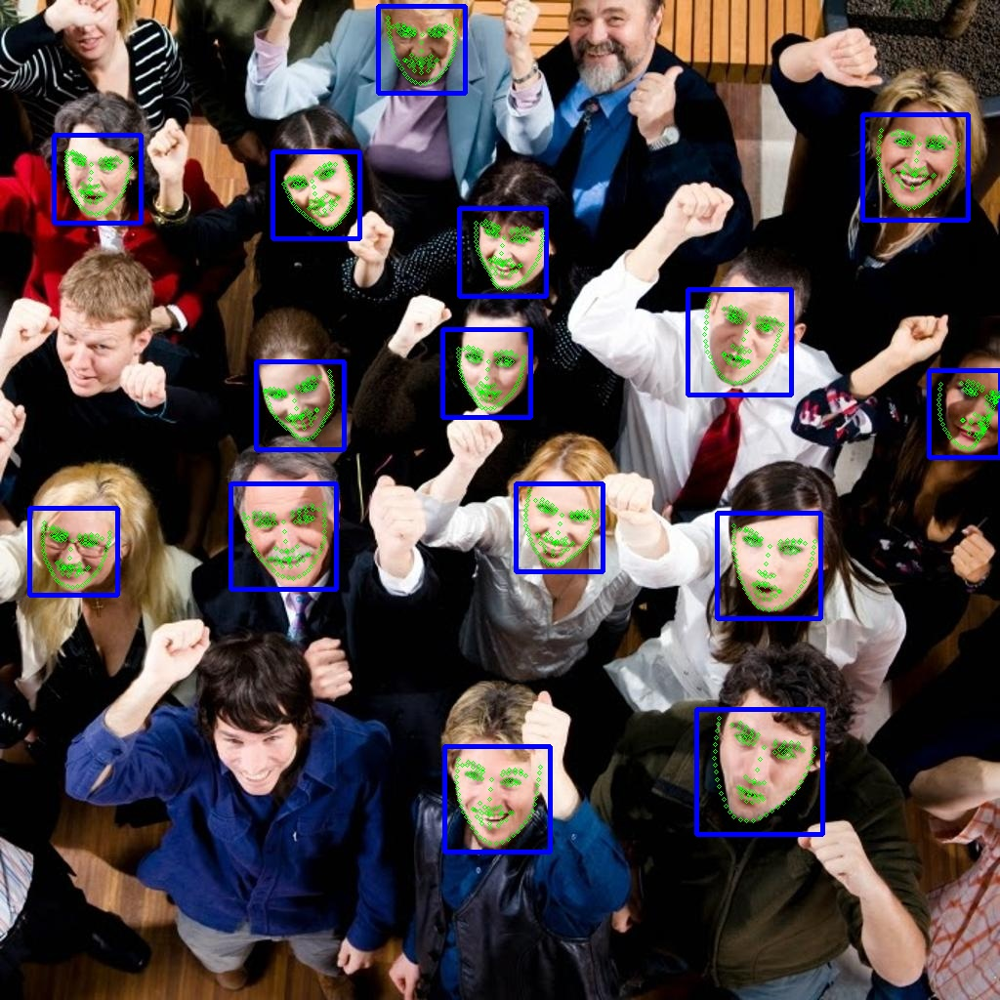

## WFLW Shape Predictor
The model provided here recognizes **98 landmarks** describing the entire face: 

 

Moreover, the folders:

* `scripts\`: contains the Python scripts (1) used to generate the XML files needed by Dlib to train the model, (2) to train and evaluate the model, (3) to test the model detection on images.
* `xml\`: contains pre-generated XML files for training and testing.

## Training Parameters

Here are the parameter used to train the model, resulting in **2.68 training error** and **5.89 test error**:

```python
options = dlib.shape_predictor_training_options()
options.tree_depth = 4
options.nu = 0.1
options.cascade_depth = 10
options.feature_pool_size = 400
options.num_test_splits = 50
options.oversampling_amount = 5
```

### Credits

Thanks to [Issue 6](https://github.com/Luca96/dlib-minified-models/issues/6) and [WFLW](https://wywu.github.io/projects/LAB/WFLW.html) authors.

